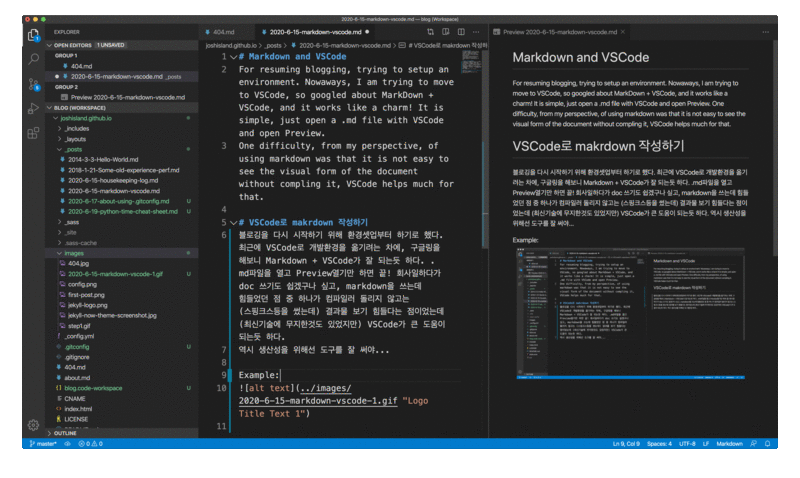

# Markdown and VSCode
For resuming blogging, trying to setup an environment. Nowaways, I am trying to move to VSCode, so googled about MarkDown + VSCode, and it works like a charm! It is simple, just open a .md file with VSCode and open Preview.
One difficulty, from my perspective, of using markdown was that it is not easy to see the visual form of the document without compling it, VSCode helps much for that.

# VSCode로 makrdown 작성하기
블로깅을 다시 시작하기 위해 환경셋업부터 하기로 했다. 최근에 VSCode로 개발환경을 옮기려는 차에, 구글링을 해보니 Markdown + VSCode가 잘 되는듯 하다. .md파일을 열고 Preview열기만 하면 끝! 회사일하다가 doc 쓰기도 쉽겠구나 싶고, markdown을 쓰는데 힘들었던 점 중 하나가 컴파일러 돌리지 않고는 (스핑크스등을 썼는데) 결과물 보기 힘들다는 점이었는데 (최신기술에 무지한것도 있었지만) VSCode가 큰 도움이 되는듯 하다.
역시 생산성을 위해선 도구를 잘 써야...

Example:

